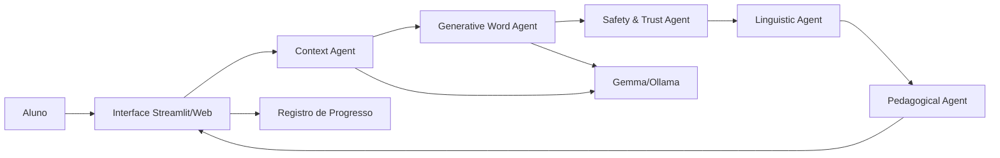

# Arquitetura da Solução

## Camadas

- Interface
- Orquestração
- Agentes
- Gateway de IA
- Dados pedagógicos
- Segurança e progresso

## Estratégia técnica

No hackathon, a demo pode rodar com mock determinístico ou Ollama local. A arquitetura permite trocar o provedor de IA sem alterar os agentes.
